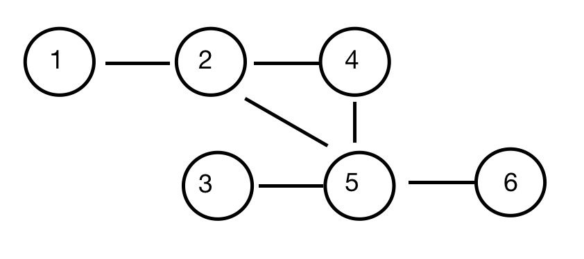

# Amazon Online Assessment Questions (2020 October)

- [Amazon Fresh Promotion](#amazon-fresh-promotion)
- [Five Star Sellers](#five-star-sellers)
- [Transaction Logs](#transaction-logs)
- [Utilization Checks](#utilization-checks)
- [Items in Containers](#items-in-containers)
- [Turnstile](#turnstile)
- [Substrings of Size K with K-1 Distinct Chars](#substrings-of-size-k-with-k-1-distinct-chars)
- [Most Common Word](#most-common-word)
- [Shopping Patterns](#shopping-patterns)
- [Amazon Music Pairs](#amazon-music-pairs)
- [Beta Testing](#beta-testing)

## Amazon Fresh Promotion

Amazon Fresh is running a promotion in which customers receive prizes for purchasing a secret combination of fruits. The combination will change each day, and the team running the promotion wants to use a code list to make it easy to change the combination. The code list contains groups of fruits.

Both the order of the groups within the code list and the order of the fruits within the groups matter. However, between the groups of fruits, any number, and type of fruit is allowable. The term "anything" is used to allow for any type of fruit to appear in that location within the group.
Consider the following secret code list: `[[apple, apple], [banana, anything, banana]]`

Based on the above secret code list, a customer who made either of the following purchases would win the prize:

`orange, apple, apple, banana, orange, banana`

`apple, apple, orange, orange, banana, apple, banana, banana`

Write an algorithm to output 1 if the customer is a winner else output 0.

**Input**

The input to the function/method consists of two arguments:

`codeList`, a list of lists of strings representing the order and grouping of specific fruits that must be purchased in order to win the prize for the day.

`shoppingCart`, a list of strings representing the order in which a customer purchases fruit.

**Output**

Return an integer 1 if the customer is a winner else return 0.

**Note**

'anything' in the codeList represents that any fruit can be ordered in place of 'anything' in the group. 'anything' has to be something, it cannot be "nothing."

'anything' must represent one and only one fruit.
If secret code list is empty then it is assumed that the customer is a winner.

```python
class Solution:
    def win_prize(self, code_list, shopping_cart):
        for code in code_list:
            print("shopping_cart: {}".format(shopping_cart))
            next_shopping_cart = self.match_in_cart(code, shopping_cart)

            if (len(next_shopping_cart) == len(shopping_cart)): return 0
            shopping_cart = next_shopping_cart
        return 1

    def match_in_cart(self, code, shopping_cart):
        for i in range(len(shopping_cart) - len(code) + 1):
            found_match = True
            for j in range(len(code)):
                if code[j] != 'anything' and code[j] != shopping_cart[i + j]:
                    found_match = False
                    break
            if found_match:
                print("found match: {}".format(code))
                return shopping_cart[i + len(code):]
        print("did not find a match for {}".format(code))
        return shopping_cart
```

## Five Star Sellers

Given the number of five-star and total reviews for each product a company sells, as well as the threshold percentage, what is the minimum number of additional five-star reviews the company needs to become five star seller.
For ex, there are 3 products (n=3) with `productRatings =[[4,4],[1,2],[3,6]]`, percentage rating `threshold = 77`.

`[1,2]` indicates => [1 (five star reviews) ,2 (total reviews)].

We need to get the seller reach the threshold with minimum number of additional five star reviews.

Before we add more five star reviews, the percentage for this seller is `((4/4) + (1/2) + (3/6))/3 = 66.66%`

If we add a five star review to 2nd product, `((4/4) + (2/3) + (3/6))/3 = 72.22%`

If we add another five star review to 2nd product, `((4/4) + (3/4) + (3/6))/3 = 75%`

If we add a five star review to 3rd product, `((4/4) + (3/4) + (4/7))/3 = 77.38%`

At this point, 77% (threshold) is met. Therefore, answer is 3 (because that is the minimum five star reviews we need to add, to get the seller reach the threshold).

Constraints:

```
1<= productRatings.size() <=200
In product ratings, [fivestar, total], fivestar <=100, total<=100
1<=ratingsThreshold< 100
productRatings contains only non negative integers.
```

Solution: Use a priority queue to store the product ratings, basically we always want to boost the product ratings
by always update the one that increase the average rating most.

For the metric we can use the difference: `r[0]+1/r[1]+1 - r[0]/r[1]`, always apply the five start rating to the
produce that would have the highest increase.

```python
import heapq
from typing import List


class Solution:
    def min_five_state_reviews(self, product_ratings: List[List[int]],
                               ratings_threshold: int) -> int:
        pq = [(-self.diff(rating), rating)
              for rating in product_ratings]  # O(n)
        heapq.heapify(pq)  # O(n)
        ave_rating = sum(map((lambda x: x[0] / x[1]), product_ratings)) / len(
            product_ratings)  #O(n)
        count = 0  # O(c)
        while ave_rating < ratings_threshold / 100:
            count += 1
            diff, rating = heapq.heappop(pq)  # O(log(n))
            rating = [rating[0] + 1, rating[1] + 1]
            heapq.heappush(pq, (-self.diff(rating), rating))
            ave_rating = sum(map((lambda x: x[1][0] / x[1][1]), pq)) / len(pq)
        return count

    def diff(self, product_rating):
        return (product_rating[0] + 1) / (product_rating[1] + 1) - (
            product_rating[0] / product_rating[1])
```

## Transaction Logs

Amazon parses logs of user transactions/activity to flag fraudulent activity. The log file is represented as an Array of arrays. The arrays consist of the following data:

`[<userid1> <userid2> <# of transactions>]`

For example:

`[345366 89921 45]`

Note the data is space delimited

So, the log data would look like:
`[ [345366 89921 45], [029323 38239 23] ... ]`

Write a function to parse the log data to find distinct users that meet or cross a certain threshold. The function will take in 2 inputs:

**Input 1**: Log data in form an array of arrays
**Input 2**: threshold as an integer

Output should be an array of userids that are sorted.

If same userid appears in the transaction as userid1 and userid2, it should count as one occurence, not two.

```python
class Solution:
    def transaction_logs(self, logs, threshold):
        user_map = {}
        for log in logs:
            log_arr = log[0].split(" ")
            user_map[log_arr[0]] = user_map.get(log_arr[0], 0) + 1
            if (log_arr[0] != log_arr[1]):
                user_map[log_arr[1]] = user_map.get(log_arr[1], 0) + 1
        target_users = []
        for key, val in user_map.items():
            if (val >= threshold):
                target_users.append(int(key))
        return sorted(target_users, reverse=True)
```

## Utilization Checks

A new Amazon-developed scaling computing system checks the average utilization of the computing system every second while it monitors. It implements an autoscale policy to add or reduce instances depending on the current load as described below. Once an action of adding or reducing the number of instances is performed, the system will stop monitoring for 10 seconds. During that time, the number of instances does not change.

Average utilization < 25%: An action is instantiated to reduce the number of instances by half if the number of instances is greater than 1 (take the ceiling if the number is not an integer). If the number of instances is 1, take no action.

25% <= Average utilization <= 60%: Take no action.

Average utilization > 60%: An action is instantiated to double the number of instances if the doubled value does not exceed 2\* 10^8. If the number of instances exceeds this limit upon doubling, perform no action.

Given an array of integers that represent the average utilization at each second, determine the number of instances at the end of the time frame.

**Example**

```
instances = 2
averageUtil = [25, 23, 1, 2, 3, 4, 5, 6, 7, 8, 9, 10, 76, 80]
```

At second 1, the average utilization averageUtil[0] = 25 <= 25. Take no action.

At second 2, the average utilization averageUtil[1] = 23 < 25. Reduce the number of instances by half, 2/2 = 1.

Since an action was taken, the system will stop checking for 10 seconds, from averageUtil[2] to averageUtil[11].

At averageUtil[12] = 76, 76 > 60 so the number of instances is doubled from 1 to 2.

There are no more readings to consider and 2 is the final answer.

**_Function Description_**

Complete the function finallnstances in the editor below.

finallnstances has the following parameter(s):

`int` instances: an integer that represents the original number of instances running

`int` averageUtil[n]: an array of integers that represents the average utilization at each second of the time frame

Returns:
int: an integer that represents the final number of instances running.

**Contraints**

```
1 <= instances <= 10^5
1 <= n < 10^5
0 <= averageUtil[i] <= 100
```

**_Solution_**

```python
import math
from typing import List


class Solution:
    def final_instances(self, instances: int, average_util: List[int]) -> int:
        """
    :type instances: int
    :type averageUtil: List[int]
    :rtype: int
    """
        i = 0
        sleep = 0
        while i < len(average_util):
            if sleep != 0:
                sleep -= 1
                i += 1
                continue
            if (average_util[i] < 25):
                instances = math.ceil(instances / 2)
                sleep = 10
            elif (average_util[i] > 60 and instances < 10**8):
                instances *= 2
                sleep = 10
            i += 1
        return instances
```

## Items in Containers

Amazon would like to know how much inventory exists in their closed inventory compartments. Given a string s
consisting of items as "\*" and closed compartments as an open and close "|", an array of starting indices
`startIndices`, and an array of ending indices `endIndices`, determine the number of items in closed compartments
within the substring between the two indices, inclusive.

An item is represented as an asterisk ('\*' = ascii decimal 42)
A compartment is represented as a pair of pipes that may or may not have items between them ('|' = ascii decimal 124).

**Example**

```
s = '|**|*|*'
startIndices = [1, 1]
endIndices = [5, 6]
```

The string has a total of 2 closed compartments, one with 2 items and one with 1 item. For the first pair of
indices, (1, 5), the substring is `'|**|*'`. There are 2 items in a compartment.

For the second pair of indices, (1, 6), the substring is `'|**|*|'` and there are 2 + 1 = 3 items in compartments.

Both of the answers are returned in an array, [2, 3].

**Function Description**

Complete the `numberOfItems` function in the editor below. The function must return an integer array that contains
the results for each of the startIndices[i] and endIndices[i] pairs.

`numberOfItems` has three parameters:

`s`: A string to evaluate

`startIndices`: An integer array, the starting indices.

`endIndices`: An integer array, the ending indices.

Constraints

```
1 ≤ m, n ≤ 105
1 ≤ startIndices[i] ≤ endIndices[i] ≤ n
Each character of s is either '*' or '|'
```

**Input Format For Custom Testing**

The first line contains a string, S.

The next line contains an integer, n, the number of elements in startIndices.
Each line i of the n subsequent lines (where 1 ≤ i ≤ n) contains an integer, startIndices[i].

The next line repeats the integer, n, the number of elements in endIndices.
Each line i of the n subsequent lines (where 1 ≤ i ≤ n) contains an integer, endIndices[i].

```python
class Solution:
    def numberOfItems(self, s, startIndices, endIndices):
        res = []
        self.cache = {}
        for i in range(len(startIndices)):
            res.append(self.get_num_items(s[startIndices[i] -
                                            1:endIndices[i]]))
        print("res: ", res)
        return res

    def get_num_items(self, s):
        print(s)
        left = s.find('|')
        right = s.rfind('|')
        if left == -1 or left == right:
            return 0
        if (left, right) in self.cache:
            return self.cache[(left, right)]
        count = 0
        for i in range(left, right + 1):
            count += 1 if s[i] == "*" else 0
        self.cache[(left, right)] = count
        return count
```

## Turnstile

Imagine a small Amazon Go store that has exactly one turnstile. It can be used by customers either as an entrance or an exit. Sometimes multiple customers want to pass through the turnstile and their directions can be different. The ith customer comes to the turnstile at time[i] and wants to either exit the store if direction [i] = 1 or enter the store if direction[i] = 0. Customers form 2 queues, one to exit and one to enter. They are ordered by the time when they came to the turnstile and, if the times are equal, by their indices.

If one customer wants to enter the store and another customer wants to exit at the same moment, there are three cases:

If in the previous second the turnstile was not used (maybe it was used before, but not at the previous second), then the customer who wants to exit goes first.

If in the previous second the turnstile was used as an exit, then the customer who wants to leave goes first.

If in the previous second the turnstile was used as an entrance, then the customer who wants to enter goes first.
Passing through the turnstile takes 1 second.

Write an algorithm to find the time for each customer when they will pass through the turnstile.

**Input**

The function/method consists of three arguments:

`numcustomers`, an integer representing the number of customers (n);

`arrTime`, a list of integers where the value at index i is the time in seconds when the ith customer will come to the turnstile;

`direction`, a list of integers where the value at index i is the direction of the ith customer.

**Output**

Return a list of integers where the value at index i is the time when the ith customer will pass the turnstile.

**Constraints**

```
1 <= numCustomers <= 10^5
0 <= arrTime[i] <= arrTime[i + 1] <= 10^9
0 <= i <= numCustomers - 2
0 <= direction[i] <= 1
0 <= j <= numCustomers - 1
```

**_Solution_**

Use two queues to store the customers entering and exiting. Use flag priority to store the current prioritized customers.

```python
from collections import deque


class Solution:
    def pass_times(self, num_customers, arr_time, direction):
        enter_q = deque()
        exit_q = deque()
        for i in range(len(arr_time)):
            if direction[i] == 0:
                enter_q.append((arr_time[i], i))
            else:
                exit_q.append((arr_time[i], i))
        # print("enter_q:", enter_q)
        # print("exit_q:", exit_q)
        t = 0
        priority = 1
        res = [None for _ in range(num_customers)]
        while enter_q or exit_q:
            exit_waiting = exit_q and exit_q[0][0] <= t
            enter_waiting = enter_q and enter_q[0][0] <= t
            if not exit_waiting and not enter_waiting:
                priority = 1
                t += 1
                continue
            if priority == 1:
                if exit_waiting:
                    res[exit_q.popleft()[1]] = t
                elif enter_waiting:
                    res[enter_q.popleft()[1]] = t
                    priority = 0
            else:
                if enter_waiting:
                    res[enter_q.popleft()[1]] = t
                elif exit_waiting:
                    res[exit_q.popleft()[1]] = t
                    priority = 1
            t += 1
        return res
```

## Substrings of Size K with K-1 Distinct Chars

As part of Day 1 challenge, your manager has created a word game for you and your teammates to play.

The word game begins with your manager writing a string, and a number K on the board.

You and your teammates must find a substring of size K such that there is exactly one character that is repeated once.

In other words, there should be K - 1 distinct characters in the substring.

Write an algorithm to help your teammates find the correct answer. If no such substring can be found, return an empty list;

If multiple such substrings exist, return all of them, without repetitions. The order in which the substrings are returned does not matter.

**Input**

It has two arguments:

`inputString`: representing the string written by the manager.

`num`: an integer representing the number K, written by the manager on the board.

**Output**

Return a list of all substrings of inputString with K characters, that have K - 1 distinct character, i.e. exactly one character is repeated,
or an empty list if no such substring exists in inputString. The order in which the substrings are returned does not matter.

**Constraints**

The input integer can only be greater than or equal to 0 and less than or equal to 26 (0 <= num <= 26).
The input string consists of only lowercase alphabetic characters.

**_Solution_**

```python
class Solution:
    def substr_of_size_k(self, input_string, num):
        left, right = 0, num
        if num >= len(input_string):
            return []

        res = []
        while right <= len(input_string):
            if (len(set(input_string[left:right])) == num - 1):
                res.append(input_string[left:right])
            left += 1
            right += 1
        return res
```

## Most Common Word

[Leetcode No.819](https://leetcode.com/problems/most-common-word/)

**_Solution_**
The idea is to extract all the words from the paragraph in lower case,
and use a dictionary to store the <word, count> pair, use a tuple (word, count) to store the most common word so far. Can solve this problem in one pass.

```python
class Solution:
    def mostCommonWord(self, paragraph: str, banned: List[str]) -> str:
        def tokenize(paragraph):
            words = []
            word = ""
            for i in range(len(paragraph)):
                if paragraph[i] in " !?',;.":
                    if word:
                        words.append(word)
                        word = ""
                else:
                    word += paragraph[i]
            if word:
                words.append(word)
            return words

        words = tokenize(paragraph.lower())
        word_map = {}
        common_word = ("", 0)
        for word in words:
            if word in banned: continue
            word_map[word] = word_map.get(word, 0) + 1
            if (word_map[word] > common_word[1]):
                common_word = (word, word_map[word])
        return common_word[0]
```

Also worth mentioning that, we don't actually need to implement a tokenize function, python actually has a regular expression lib that can match all the words with ease:

```python
import re
words = re.findall(r"\w+", paragraph)
```

## Shopping Patterns

Amazon is trying to understand customer shopping patterns and offer items that are regularly bought together to new customers. Each item that has been bought together can be represented as an undirected graph where edges join often bundled products. A group of n products is uniquely numbered from 1 of product_nodes. A trio is defined as a group of three related products that all connected by an edge. Trios are scored by counting the number of related products outside of the trio, this is referred as a product sum.

Given product relation data, determine the minimum product sum for all trios of related products in the group. If no such trio exists, return -1.

**Example**

```
products_nodes = 6
products_edges = 6
products_from = [1,2,2,3,4,5]
products_to = [2,4,5,5,5,6]
```

| Product | Related Products |
| :-----: | :--------------: |
|    1    |        2         |
|    2    |     1, 4, 5      |
|    3    |        5         |
|    4    |       2, 5       |
|    5    |    2, 3, 4, 6    |
|    6    |        5         |



A graph of n = 6 products where the only trio of related products is (2, 4, 5).

The product scores based on the graph above are:

| Product | Outside Products | Which Products Are Outside |
|:-------:|:----------------:|:--------------------------:|
|    2    |        1         |              1             |
|    4    |        0         |             N/A            |
|    5    |        2         |            3, 6            |

In the diagram above, the total product score is 1 + 0 + 2 = 3 for the trio (2, 4, 5).

**Function Description**

Complete the function `getMinScore` in the editor below.

`getMinScore` has the following parameter(s):

int `products_nodes`: the total number of products

int `products_edges` the total number of edges representing related products

int `products_from[products_nodes]`: each element is a node of one side of an edge.

int `products_to[products edges]`: each `products_to[i]` is a node connected to `products_from[i]`

Returns:

int: the minimum product sum for all trios of related products in the group. If no such trio exists, return -1.

**Constraints**

```
1 <= products_nodes <= 500
1 <= products_edges <= min(500, (products_nodes * (products_nodes - 1)) / 2)
1 <= products_from[i], products to[i] <= products_nodes
products_from[i] != products_to[i]
```

**_Solution_**

The idea is to build a graph with edges and degrees computed. The score of a
trio equals to the sum of the degrees - 6. To decide whether there is a trio,
just iterate through each edge (u, v) and see if we can find a third node w that (u, w) and (v, w) exist in the graph.

This solution is O(\|V\| \* \|E\|)

```python
from collections import defaultdict


class Graph:
    def __init__(self, num_nodes, num_edges):
        self.nodes = list(range(1, num_nodes))
        self.num_edges = num_edges
        self.edges = defaultdict(set)
        self.degrees = defaultdict(int)

    def add_edge(self, n1, n2):
        self.edges[n1].add(n2)
        self.edges[n2].add(n1)
        self.degrees[n1] += 1
        self.degrees[n2] += 1

    def get_degree(self, n):
        return self.degrees[n]

    def edge_exist(self, n1, n2):
        return n2 in self.edges[n1]


class Solution:
    def get_min_score(self, products_nodes, products_edges, products_from,
                      products_to):
        g = Graph(products_nodes, products_edges)

        for i in range(len(products_from)):
            g.add_edge(products_from[i], products_to[i])

        min_score = float('inf')
        visited_trios = set()
        for start_node, end_nodes in g.edges.items():
            for end_node in end_nodes:
                # For each edge, find a third node check if trio
                for node in g.nodes:
                    if node == end_node or node == start_node or tuple(
                            sorted([start_node, end_node, node
                                    ])) in visited_trios:
                        continue
                    if g.edge_exist(start_node, node) and g.edge_exist(
                            end_node, node):
                        # Got a trio
                        min_score = min(
                            g.get_degree(start_node) + g.get_degree(end_node) +
                            g.get_degree(node) - 6, min_score)
                        visited_trios.add(
                            tuple(sorted([start_node, end_node, node])))
        return min_score if min_score != float('inf') else -1
```

## Amazon Music Pairs

[Leetcode No.1010](https://leetcode.com/problems/pairs-of-songs-with-total-durations-divisible-by-60/)

**_Solution_**

We can use a map to store the count of the songs for each length % 60. Basically a pair of <length % 60, count>. We only care about the remainder of the length after mod 60. While we iterate through the songs, we:

1. Check if there is such key in the map, the sum of that key and current song length % 60 is divisible by 60, if yes, increment the result by the value of that key (count of the qualified songs).

```python
class Solution:
    def numPairsDivisibleBy60(self, time: List[int]) -> int:
        songs = {}
        res = 0
        for idx, song in enumerate(time):
            if (60 - song % 60) % 60 in songs:
                res += songs[(60 - song % 60) % 60]
            songs[song % 60] = songs.get(song % 60, 0) + 1
        return res
```

## Beta Testing

[Leetcode No. 1335](https://leetcode.com/problems/minimum-difficulty-of-a-job-schedule/)

**_Solution_**

```python
class Solution:
    def minDifficulty(self, jobDifficulty: List[int], d: int) -> int:

        # dp[i][k]: min difficulty to schedule the first i jobs to be
        # finished in k days
        # Base case: dp[0][0] = 0, dp[*][*] = inf
        # Transition: dp[i][k] = min: dp[j][k-1] + max difficulty between
        # [j+1~i] where k-1 <= j < i
        # Meaning: try different first j jobs within k-1 days
        n = len(jobDifficulty)
        if d > n: return -1

        dp = [[float('inf') for _ in range(n + 1)] for _ in range(n + 1)]
        dp[0][0] = 0

        # bottom up: need to fill dp[1][1], dp[1][2]
        for i in range(1, n + 1):  # for the first i tasks
            for k in range(1, d + 1):  # for the first k days
                if k > i: break
                # dp[i][k] = min(dp[j][k-1] + difficulty for each j)
                # Reverse order: when j = i - 1, max_diff = jobDifficulty[i]
                max_diff = 0
                for j in range(i - 1, k - 2, -1):
                    max_diff = max(max_diff, jobDifficulty[j])
                    dp[i][k] = min(dp[i][k], dp[j][k - 1] + max_diff)

        return dp[n][d]
```
